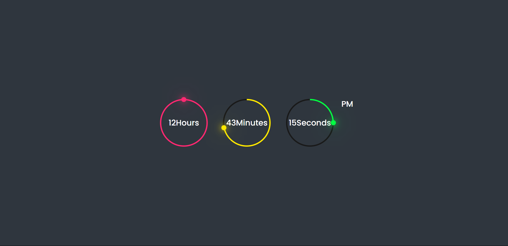

# ⏰ Digital Clock

A simple and elegant digital clock built using HTML, CSS, and JavaScript. It displays the current time in HH:MM:SS format and updates every second in real time.

---

## 🚀 Features

- 🕒 Real-time time display (auto-updating every second)
- 🎨 Stylish and minimal UI
- 📱 Responsive design for all screen sizes
- 🌗 Light and dark-friendly color scheme 

---

## 🛠️ Tech Stack

- HTML5
- CSS3
- JavaScript (Vanilla JS)

---

## 📸 Screenshot

### 🕒 UI Preview

---

## 🔗 Live Demo
Check out the live version of this project here:  
👉 [Digital Clock Live](https://digital-clock-aman.netlify.app)

